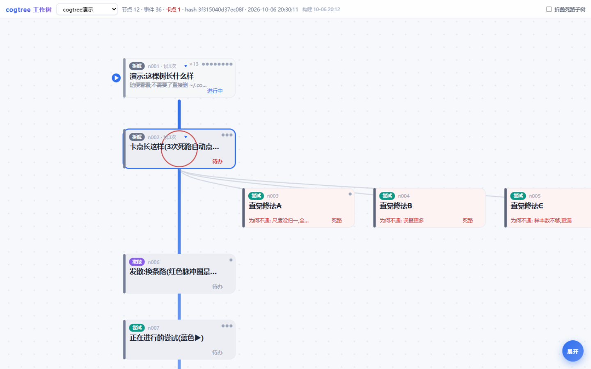
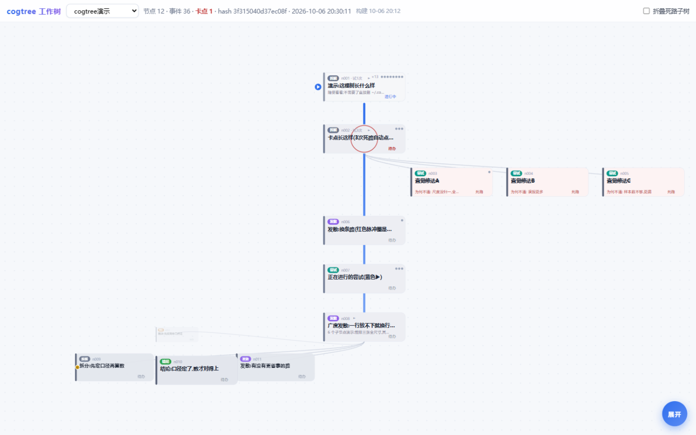
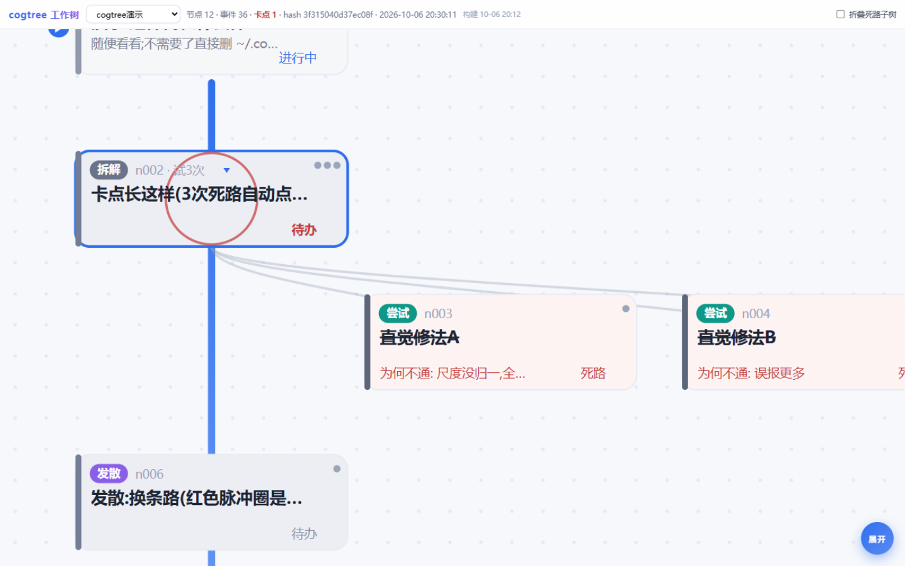

# cogtree —— 思维工作树

把 LLM 干活时「在想什么 / 试了什么 / 死在哪」落到盘上的一棵树里:对话窗口之外随时可看,跨会话可再定位,过程可审计。

灵感来自 AlphaGo 核心作者 Thore Graepel 的批评:LLM 是被拉长的直觉(系统 1),没有可检查的认知状态,思维链经常是事后编的。cogtree 就是那个缺失的**显式认知状态**——树在盘上,每次增改是一条 append-only 事件,谁也改不了历史;卡点由确定性规则点亮,不靠模型自觉。

## 它解决什么

现有 todo/计划模式是**执行队列,不是认知图**:

- 广度丢失:试过哪些路、为什么放弃,新会话一概不知,还会再撞一遍
- 深度混淆:"做完了"和"解决了"没有区分
- 循环不可见:反复调一个错,视图里只是一根箭头钉在原节点不动

cogtree 的答案:attempt 节点记录每次尝试及其死因;同一问题累计 3 次死路自动亮 **[卡点×3]**(确定性规则,阈值 `COGTREE_STUCK_AT` 可调);新会话一句 `tree_view` 就能再定位,不用翻历史对话。

## 启用边界(重要)

- **日常问答不建树**:查资料、闲聊、一次性小问题,不调任何 cogtree 工具
- **项目操作才启用**:开发、调试、排障、推进方案这类多步工作才建树;拿不准时先问用户一句"要不要开工作树记录"
- **随时可关**:`COGTREE_DISABLE=1` 后所有工具返回"已停用"而非报错

## 五个工具

| 工具 | 何时调用 |
|---|---|
| `tree_init(name, root_title)` | 项目任务开始,根=要解决的根本问题;同名幂等 |
| `node_add(tree_id, parent_id, kind, title, why?)` | kind: step=主干顺序步骤(深度方向) problem=拆小问题 explore=发散思路 attempt=一次具体尝试 finding=结论 decision=裁决 |
| `node_update(tree_id, node_id, status?, ..., kind?, parent_id?)` | 改状态/内容,**也改分类(kind)与挂靠(parent_id)**——修正之前的内容用它,不要重复建节点 |
| `node_remove(tree_id, node_id, reason)` | 删除建错/建重的节点(连整棵子树),reason 必填,事件流留痕 |
| `node_touch(tree_id, node_id / node_ids, note?)` | **轮次归纳**:每轮工作结束前想清楚这一轮本质上在推进哪些问题,对它们各记一次(支持 `node_ids` 批量);多轮打磨同一问题必须归到同一节点,轮数如实累积;零散讨论归纳到最贴近的问题节点或先建归拢节点,不许游离在树外 |
| `tree_view(tree_id?)` | 紧凑文本树(状态+轮次+卡点+死路原因);新会话开工先调它 |
| `tree_list()` | 列出所有树概况 |

约定:**节点=一项具体要解决的问题或一次尝试,不是一条消息一个节点**;**修正优先于重建**——会话常常是修正而不是新问题,错了就 node_update(内容/状态/分类/挂靠),只有确实多余才 node_remove 并写明原因;**主干模式**:顺序性工作用 step 依次建主干(视图里从左到右带箭头脊线+①②③序号),执行中的问题/尝试挂到当前 step 下而不是根,step 内再有顺序子步骤就递归成子主干;**做完 ≠ 解决**——目标确认达成才 resolved,试过没成就 dead_end 并写清 why(卡点检测对 problem/explore/**step** 一律生效);两个刻度分开看:**轮次**=在这上面聊了几轮(卡片右上角圆点),**尝试**=具体动了几次手(attempts 为派生值,移动/删除后自动重算)。

## 快速开始

```bash
# 本机自检(零依赖,Python ≥3.9)
python server.py --selfcheck

# 独立浏览已有树(不开对话)
python -m cogtree.viewer            # 打开 http://127.0.0.1:8765/
```

MCP server 启动时自动带起 viewer(仅绑 127.0.0.1,端口 8765 起自动后移),浏览器打开工具返回的 `viewer` 字段地址即可实时看树(SSE 推送,断线自动轮询兜底)。

**多窗口一致性(内置浏览器与系统浏览器看到的不一样?)**:viewer 保证任何窗口看到的内容相同——
1. 所有响应带 `Cache-Control: no-store`,改版即刻可见,不存在"你那边是旧页面";
2. **URL 锚点记录当前树**:`http://127.0.0.1:8765/#<tree_id>`,切换树时地址栏自动更新,任何窗口打开同一地址即同一视图(两端不一致时先对比地址栏);
3. 工具栏显示 **构建时间**(服务端注入的 index.html 修改时间),两边不一致时对比它即可判断谁在跑旧版。

Viewer 交互(v0.11):**纵向主干**——根在上,主干站点①②③…沿一条纵向脊线从上往下排列,每个站点的子树挂其右下(整体右移让开脊线),节与节之间留缝;一行读完一棵树,宽度天然有界;**分支配色**:每个主干站点各占一个色相,其下每一代子节点同色相逐代加深(左色条+卡底浅染+连线同步),根节点中性蓝灰,状态色退到文字层;**子树横向排列**:每个节点的孩子是一行横排卡(≤3 张居中;**>3 张=椭圆环**——全员在环上,正前方 3 张全尺寸,两侧按环深缩小减淡,背面小卡仍可见可点);**旋转=椭圆轨迹**:左键按住任意环中卡拖动(卡片悬停为左右拉伸光标),整排连各自子树**绕椭圆轨道转动**(u=i-s-1 连续映射,前排三张约一个节距,其余绕向背面;全程零跳变),滚轮横扫同效;空白处左键拖动=平移视图;松手落位;点背面小卡把它旋进正前方;**子树刚性跟随**:环卡的整支子树与父卡同一合成变换(位置+等比缩放),转到哪跟到哪,连线/脊线端点同步;**四个视图模式**:邻域聚焦(默认)/全景视图/展开全部/收纳主干;点节点=选中+展开/收起它的子树(可同时展开多棵,再点一次收起;贴边非操作的后排卡不响应);悬停出全内容浮层;卡点红色脉冲圈;适配视图按布局预留(含环的最大占位)取景。

### 安装(从本仓库分发)

1. ZCode → 插件/市场 → **添加市场**,填本仓库地址(GitHub 仓库 URL;若该版本只接受本地路径,`git clone` 后填本地目录);
2. 在该市场里**安装 cogtree**,启用后 7 个 `cogtree_*` 工具即可调用,viewer 由 MCP server 一并带起(127.0.0.1:8765);
3. 更新:改源码 → 升 `plugin.json` 版本 → 市场里**刷新该市场**再更新。

要求:Python ≥ 3.9(零第三方依赖),`python` 在 PATH 中(插件 `.mcp.json` 用 `python` 启动 server)。

### 接入 ZCode

以本地插件方式注册(见仓库内插件壳),重启 ZCode 后五个 `cogtree_*` 工具直接可调。

### 接入其他 harness(Claude Code / Cursor 等)

通用 stdio MCP 配置片段:

```json
{
  "mcpServers": {
    "cogtree": {
      "command": "<你的 python 路径>",
      "args": ["<本仓库路径>\server.py"]
    }
  }
}
```

(把 command/args 换成对方 harness 要求的写法即可;协议是标准 MCP stdio。)

## 界面一览



- **主干纵向**:根在上,主干站点①②③…沿一条纵向脊线从上往下排;点节点=选中+就近沿轨转动+展开/收起它的直接孩子一层(再点收起,可同时展开多棵);编号后的小三角=可展开(系统按有无子节点判定,叶子不显示:`▸`未展开 / `▾`已展开);右上圆点=轮次(子树累计)。



- **子树横向**:孩子一行横排;超过 3 个成**椭圆环**(正前 3 张全尺寸,两侧按环深缩小渐隐,背面小卡只展示不可操作);左键按环卡拖动=整排连子树绕椭圆轨转动(首尾相接,可无限转;金点=环起点);主干各站子树**左右交替**悬挂,互不遮挡。



- **卡片**:左侧色条=分支色相(主干一色、子代逐代加深) · 左上色签=类型或主干序号 · `编号`+试次+可展开三角 · 右上轮次圆点 · 标题/描述/结果行 · 右下状态字(状态色仍在文字上:死路删除线+红字、受阻橙字、卡点红圈)。

## 存储与审计

```
~\.cogtree\trees\<tree_id>\
  events.jsonl   # 唯一事实来源,append-only:{seq, ts, op, ...}
  tree.json      # 可选缓存物化(默认不写、从不回读;COGTREE_CACHE=1 才生成)
```

- 加载一律从事件重放;`check_model` 钉死了"重放哈希一致"与"篡改事件哈希必变"
- tree_id = 名称清洗 + sha1[:8],同名幂等,路径穿越被拒

## 测试(全 stdlib,零安装)

```bash
python tests/check_static.py         # 语法编译 + AST 未定义名扫描(NameError 防线)
python tests/check_model.py          # 卡点边界/重放一致/幂等/校验/UTF-8
python tests/check_e2e_scenario.py   # E5式调试循环:3死路→[卡点×3]→发散→解决→清除
python tests/check_protocol.py       # 子进程假 harness 走完 MCP 全流程+错误路径
python tests/check_viewer.py         # HTTP 接口 + SSE ≤2s 推送
```

浏览器内两个片段(evaluate 执行,详见"会话收尾自查清单"):

- `tests/fuzz_viewer_snippet.js` —— 双模式模糊测试:铺开/转盘各两轮随机点击 + 拖动连续性;单次 evaluate 有 3s 上限,该片段可分步执行,**反复 evaluate 直到返回 `{done:true,total:0}`**
- `tests/walkthrough_snippet.js` —— 日常操作走查:行布局互切/四模式/折叠按钮/换树/点卡/悬停一轮跑完,返回逐步断言结果

## 环境变量

| 变量 | 默认 | 作用 |
|---|---|---|
| `COGTREE_STORE` | `~\.cogtree\trees` | 树库根目录 |
| `COGTREE_STUCK_AT` | 3 | 卡点阈值(死路 attempt 数) |
| `COGTREE_DISABLE` | (未设) | =1 全部停用(日常问答模式) |
| `COGTREE_NO_VIEWER` | (未设) | =1 不启动 viewer(测试用) |
| `COGTREE_CACHE` | (未设) | =1 额外物化 tree.json 缓存(默认关闭) |

## 三态架构

- **渲染视图**(viewer):人看的 2D 画面——主干带+站点+芯片+卡点脉冲
- **内部状态**(`events.jsonl` + `tree.json`):append-only 事件流,可重放、可审计、篡改必现
- **思路图谱**(`tree_view` 输出):给 LLM 读的会话态——**主干=有向序列**(先后次序,`根 → ① → ② → …`),**分支=无向关联**(知识图谱式,`站点 — 问题 — 尝试`),附**当前进行**(根到活跃节点的路径)与**卡点**;长会话每轮开始先读它找准自己在做什么

## 会话收尾自查清单(每次改动 viewer/协议后,模拟日常使用跑一遍)

> **验收铁律:以渲染截图为准。** 我看到什么就是用户看到什么——渲染出来是错的,内部状态再"正确"也是错的。内部探针只许用来定位病因,永远不许当"没问题"的依据。

1. **默认聚焦**:不展开子树,能否看清——当前要解决什么(中心卡片)、采用了什么方法(结果行/why)、是否还要纠结(卡点脉冲与死路芯片)、各主干站点欠什么(站点下方芯片)
2. **全景往返**:切全景再回聚焦,顶层主干保持全亮、无卡片互挡、无出视口
3. **芯片交互**:点芯片把该子节点旋进窗口展开;**铺开模式下整行本就全显**,转盘模式才需要旋窗;折叠死路开关不产生残缺状态;全景点卡开侧栏、切聚焦侧栏消失,无残留
   3b. **四模式**:展开全部=全节点全尺寸零芯片;收纳主干=仅根+顶层主干;收纳态点站点自动回跳聚焦;模式按钮高亮与状态一致
   3c. **行布局互切**:铺开↔转盘来回切——铺开下宽行换行全显(5→3+2 且行间不压、行居父中),转盘下右键拖动整排连子树 1:1 旋转、松手落位;切模式后按钮文案/高亮一致,折叠按钮语义随模式切换(铺开=收起/转盘=展开)
4. **多帧稳定**:重载至少两帧各自截图,间歇性消失/错位必须为零
5. **模糊测试**:浏览器里执行 `tests/fuzz_viewer_snippet.js`,断言 铺开/转盘两模式各 150 次混合点击 + 拖动连续性扫描零失败(中心全尺寸/祖先链/整行全显/换行数与行距/两两不挡/无透明残留/子树随父旋转);再跑 `tests/walkthrough_snippet.js` 日常操作走查全过
6. 发现的 bug 当场修掉再交付,不带病过夜

## 路线

- **v0(当前 v1.0.0,公开发布版)**:主干纵向脊线 + 子树横向排布(宽行椭圆环、可无限旋转) + 分支配色 + 逐层展开/收起 + 卡点/轮次/死路全落盘可重放;v1.0.0 之前的迭代记录见文末"路线"之前的开发说明
- **v1**:裁判评分(节点 confidence + 每步"消解了什么不确定性")、卡点后的发散建议、协议 skill 强化
- **v2**:3D 力导向视图(树数据模型不变,viewer 只是投影)、todo 自动同步、多树对比/合并

## 许可证

MIT,见 [LICENSE](LICENSE)。
